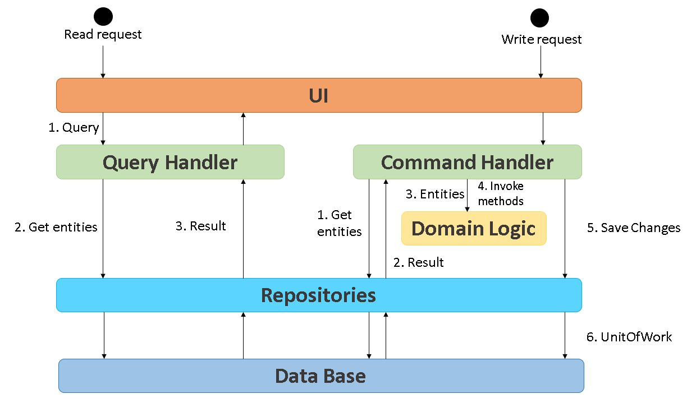
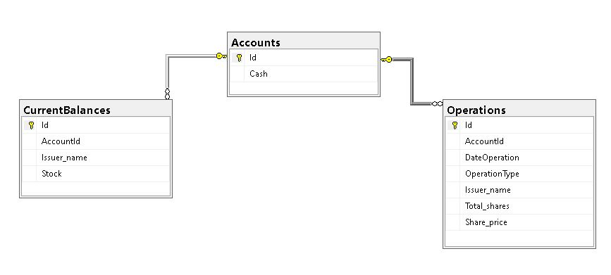

# Brokerage Firm Challenge - Luis Bragado

## Descripción
El proyecto tiene como objetivo exponer servicios API para la compra/venta de emisoras. Está creado principalmente con el enfoque DDD y el patrón CQRS con el objetivo de generar una solución con características principales como: 
* Simple: al ser enfocada al dominio se mantiene la lógica de negocio en un solo lugar por lo tanto es más comprensible. 
* Mantenible: que la integración de cambios sea rápida, eficiente y segura ya que al separar las responsabilidades aseguramos que comandos de actualización no causen conflictos a nivel de dominio. 
* Escalable: Con la implementación del patrón CQRS se dividen las operaciones de lectura y actualización, con esto podremos maximizar el rendimiento, escalabilidad y seguridad del aplicativo.

## Lo que incluye en este proyecto
* Patrón CQRS con .Net C#
* Implementación de MediatR, Repository, UnitOfWork. 
* Implementación de Swagger 
* Unit Test

## Prerequisitos
* Visual Studio 2019
* .Net Core 3.1

## Instalación
1. Clonar el repositorio. 
2. En raíz se encuentra el script para generar la base de datos (BrokerageDB.sql). Abrir SQL Server Management y correr dicho script.
3. Abrir la solución del proyecto.
4. Para configurar la cadena de conexión abrir el archivo BrokerageFirm\WebAPI\appsettings.json
```csharp
"RepositoryDB": "Server=(localdb)\\mssqllocaldb;database=BrokerageDB"
```
5. Correr el proyecto. 

## Diseño


## Base de Datos


## API Endpoints
El aplicativo expone 2 endpoints con el siguiente funcionamiento:
* Accounts - POST /api/Accounts  
Este endpoint permite crear una Cuenta con su respectivo saldo. La tabla en la que almacena la información es Accounts.
* Orders - POST /api/Orders{accountId}/orders
Este endpoint permite generar una orden de Compra/Venta de emisoras. Las tablas que afecta son las siguientes:
	1. Accounts: actualiza el saldo de la cuenta (si es una compra resta el saldo, si es una venta incrementa el saldo). Con este campo de saldo se realiza la validación si se tiene suficiente saldo para realizar una compra. 
	2. CurrentBalances: en esta tabla se tiene la relación de la Cuenta-Emisora-Stock. Cuando se realiza una compra incrementa el stock de la Cuenta-Emisora, cuando se realiza una venta disminuye el stock de la Cuenta-Emisora. Con este campo de Stock se realiza se valida si se tiene la candiad suficiente para realizar una venta. 
	3. Operations: En esta tabla se registran todas las operaciones que se realizan para llevar un histórico. 

## Timestamp
Cabe mencionar que las operaciones sólo pueden realizarse en un horario de 06:00 am a 15:00 pm. El endpoint para generar órdenes de Compra/Venta recibe un campo con el timestamp de la operación. Como ayuda puede obtener el Timestamp de una fecha con el uso de alguna herramienta online como [Timestampgenerator](http://timestampgenerator.com/1635886768/-06:00) es importante seleccionar el Timezone: GMT-6 ya que la validación que se realiza es contra LocalTime. 
